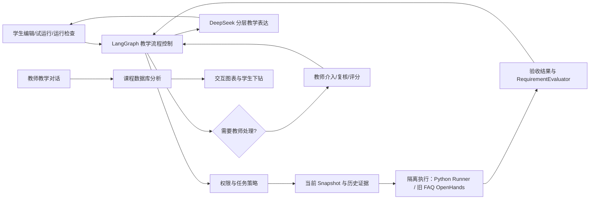

# AI 实训教练项目总说明

版本：2026-09-24
项目路径：`D:\TeachingAgent`
文档用途：以当前代码和已运行的 Stage 06 演示环境为准，说明产品定位、智能体分工、用户流程、启动方式、数据结构、验证结果和交付边界。

> 本文是当前实现说明，不把早期设计文档中的 P0 目标自动当成已交付功能。历史设计与阶段报告仍保留在 `docs/` 和 `reports/` 中；需要判断功能是否存在时，以本文和当前代码为准。

## 1. 项目是什么

这是一个面向高职人工智能技术应用专业的 AI 应用开发实训系统。学生在浏览器中编辑和运行一个真实的小型 Python 项目，系统基于代码快照、运行结果和验收证据给出分层提示；教师在课堂工作台查看谁需要帮助、查看证据、介入指导、复核作品并发布正式成绩。

默认学生任务是 **PYB-01-v1「两数相加」**，任务栏可切换 **PYB-02「判断是否及格」** 和 **PYB-03「遍历列表求和」**。三题都属于明确标识的 Python 基础编程示例课程，统一在 `main.py` 中完成。Run 检查公开样例，Submit 再运行服务端持有预期结果的边界用例，通过后才建立 Submission。所有验收结果对应同一 Snapshot，教师能从课堂名单进入任务与证据详情。三题默认使用独立 Python Runner；旧 FAQ 继续使用 OpenHands。真实业务 API 验收见[阶段 02](WORKSHOP_STAGE02_IMPLEMENTATION.md)、[阶段 03](WORKSHOP_STAGE03_RUNNER.md)、[阶段 04](WORKSHOP_STAGE04_AGENT_TASKS.md)和[阶段 05](WORKSHOP_STAGE05_UI.md)。

旧 **FAQ-001-v1「校园服务问答小程序」** 保留为回归和教师虚拟课堂数据。该任务需要完成 `retrieve(question, sources)`，让程序能够：

- 从 `data/faq.json` 资料中命中校园服务问题；
- 对资料外的问题返回空结果；
- 在回答中保留来源标题和 URL；
- 运行 `python faq_app.py` 查看结果，并通过阶段检查和提交完成任务。

产品的核心不是一个自由发挥的聊天机器人，而是一个有证据、有权限、有教师接管点的教学闭环：



## 2. 当前的智能体和角色安排

当前是“一条受控教学流程 + 两个用户入口 + 一个按任务分流的执行层 + 真人教师接管”，不是多个自主 AI 互相辩论的 Agent 集群，也没有使用 OpenAI Agents SDK。项目使用 LangGraph 做流程控制，使用 OpenAI-compatible 的 DeepSeek Chat Completions 适配器做文本生成。PYB-01/02/03 默认由独立 Python Runner 执行，旧 FAQ 回归任务仍由 OpenHands 执行。

| 角色 | 面向谁 | 当前真实职责 | 明确不能做什么 |
|---|---|---|---|
| 学生 | 学生本人 | 编辑自己的文件、保存、创建 Snapshot、试运行、运行阶段检查、填写排查记录、请求指导、求助教师、提交作品 | 不能读取其他学生任务、改变策略或成绩、调用未授权工具 |
| AI 实训教练 | 学生 | 根据当前 Snapshot、检查结果、学生观察和历史提示生成 L0/L1/L2 下一步指导 | 不直接改代码；不能越过服务端策略给完整答案；考核模式只允许 L0 |
| LangGraph 教学流程控制器 | 系统 | 校验事件和权限、加载任务策略、收集证据、决定执行工具/生成指导/等待/教师介入、评估阶段和恢复流程 | 不把决策权交给模型；不负责账号体系或正式成绩 |
| Python Runner / OpenHands 执行器 | 系统 | 按任务在隔离 Docker 容器运行服务器白名单工具，返回 stdout/stderr、退出码和结构化证据；PYB-01/02/03 使用 Runner，旧 FAQ 使用 OpenHands | 不选择教学策略、帮助级别、阶段或成绩；不与学生聊天 |
| RequirementEvaluator | 系统 | 汇总静态检查、自动测试、学生解释、教师复核等要求，判断阶段是否满足 | 不自动发布正式成绩 |
| DeepSeek 教学表达引擎 | 系统 | 把服务器已经选定的帮助级别表达成简短、可执行的提示，并返回证据引用、下一步和不确定性 | 不能修改权限、阶段、失败计数、成绩或工作区 |
| 教师教学助手 | 教师 | 与教师自由对话，话题不限；涉及班级学情时读取课程已保存数据并只依据真实统计回答，可生成桑基/柱状/折线/表格/热力图并提供学生下钻 | 不能执行学生代码、改作品、改成绩、创建任务或生成图片 |
| 真人教师 | 授课教师 | 查看课堂、查看证据、发送指导、允许 L2、暂停/恢复 AI、复核阶段、评价并发布正式成绩 | 系统不会用 AI 建议替代教师确认 |
| 系统 actor | 后端 | 在验收失败后按规则触发有限的指导跟进，持久化事件和恢复状态 | 不拥有教师的评分权限 |

教师详情页的“查看运行依据”会展示一条可追溯链：

`学生行为 → Python Runner 或 OpenHands 实训证据 → RequirementEvaluator 验收结论 → LangGraph 教学决策 → DeepSeek 教学表达`

## 3. 学生端实际流程

1. 打开 `http://127.0.0.1:5173/`，用演示账号登录；也可选择“注册 → 学生”，填写账号、密码并选择教师已创建的班级。注册后会自动进入学习空间；若班级还没有可用练习，会显示待发布状态，练习出现后自动刷新。
2. 默认进入 PYB-01「两数相加」。起始 `main.py` 故意写错了一个变量名：先试运行观察错误，再修改代码。左侧文件区可新建、重命名和删除文件。PYB-02/03 则保留补全式起始代码。
3. 保存代码（可用 Ctrl+S）。Python 任务点击“试运行”后，底部会打开可调整高度的终端窗口；点击窗口即可聚焦光标，在程序运行到 `input()` 时直接键入并按 Enter。↑↓ 可找回本次运行的输入；窗口顶部可结束输入或停止运行。输出和 Python 报错持续显示，运行结束后保留退出码和代码版本。当前改错示例输入 `2`、`3` 会显示第 5 行的 `NameError`；修复后应输出 `5`。此窗口接收 Python 程序输入，不开放宿主系统命令；试运行不计入阶段验收。
4. 需要逐行排查时，点击行号旁或在编辑器内按 F9 设置断点，再点击“调试”。程序在隔离 Runner 中按第一组公开样例实际运行一次；“调试”页可回放执行行、查看当时的局部变量，并逐步前进、后退或继续到断点。
5. 点击“运行公开检查”时，系统保存当前版本并创建或复用 Snapshot，由独立 Python Runner 执行公开样例；“提交”对同一 Snapshot 运行隐藏边界检查。
6. 需要提示时打开“AI 教练”，点击“分析当前代码”请求下一步；可展开“记录我的排查”补充观察，或点击“求助教师”。提示基于已保存的代码版本和已有检查证据按需生成；对 Python 基础题，当前快照的公开检查诊断码、错误类型和行号也会进入模型证据摘要。隐藏测试具体用例不发送，并非每次敲键都实时刷新。
7. 公开样例通过后点击“提交”；隐藏检查通过才生成提交，未通过时保留代码和运行证据供继续排查。
8. 提交后的版本只读保存，学生仍可继续编辑；“查看提交”进入学习复盘，查看提交文件、验收、AI 协助记录和教师正式成绩。

学生端的提示不是按每次敲键实时调用模型。运行检查、请求指导、失败后的受控跟进会触发服务端流程；事件通过 SSE 自动推送，断线后客户端会携带最后状态版本重连补读。教师端状态列表每 5 秒刷新。

调试为**一次真实运行后的轨迹回放**，支持断点导航、单步浏览和局部变量查看，不会暂停一个仍在运行的 Python 进程。若此前在交互式终端输入过内容，调试会复用最近一次输入；否则使用公开样例。调试不支持变量修改或任意命令入口。轨迹长度与输出大小受限，超长程序会提示截断。调试不执行隐藏检查，也不改变成绩。

分层提示的实际边界：

- **L0**：提问、澄清现象、要求学生先观察；独立考核强制使用此级别。
- **L1**：指出机制、条件或检查方向；需要任务策略和有效观察/尝试记录。
- **L2**：有限的局部脚手架或片段示例；必须由任务策略或教师授权，不能变成整段答案。

## 4. 教师端实际流程

### 4.1 课堂

教师进入 `http://127.0.0.1:5174/` 后看到“课堂”“教学对话”“课程设计”“班级”四个主入口。课堂默认选择 Python 基础编程示例课程，也能切换旧 FAQ 课程；名单只显示所选课程，按“待处理 / 进行中 / 已完成”分组。公开检查信号按每名学生每道题的最近尝试统计失败与未检查情况，点击信号可进入代表学生。点击学生可查看“概览 / 证据 / 教学过程”，包括当前阶段、失败次数、Snapshot、公开样例输入与预期/实际结果、样例级技能证据、提示历史、求助和教师指导。它不推断学生掌握度。

教师可以发送指导；存在活动介入时可以“发送提示并继续学习”、保持当前指导、允许局部示例或暂停智能指导。包含教师复核的阶段会显示“确认通过 / 需要修改”。有提交时可以打开评价页，填写量规分值和理由、保存草稿，全部必要项确认后发布正式成绩；发布后评价锁定。

教师在“班级”入口创建班级，可以立即关联自己负责的课程，也可以稍后关联；学生注册时选择班级，名单会在教师端自动刷新。关联已有 Python 基础课程时，系统为班内学生创建该课程已发布且受支持的练习 Attempt 和独立工作区。教师可以在“课程设计”建立自己的课程并整理题目草稿；草稿在配置可运行测试前不会进入学生端。已有可运行演示任务仍由后端脚本初始化。

### 4.2 教学对话和交互图表

“教学对话”是与教师的自由对话，话题不限于班级学情：教学设计、技术问题或一般问题都可以讨论。前端没有预设提问和固定图表。每次提问先读取教师有权限的当前课程数据库；模型通过只读 `query_classroom` 工具选择是否需要图表、图表类型、统计范围和维度；服务端按该选择聚合实时记录并生成可交互图表。模型再依据本次查询结果生成自然语言回答，通过 `POST /api/product/teacher/assistant/messages/stream` 逐字返回。图表数值不由模型编造。模型或网络出错时界面保留教师输入并提供重试，不保存未完成的回答。

支持的图表不是图片，而是前端可交互的数据组件：

- 桑基图：模型从当前阶段、状态、任务和公开检查中选择两个维度；点击节点或连线查看学生。
- 柱状图：按模型选择的一至两个维度聚合人数；点击分类查看学生。
- 折线图：仅按 UTC 日期展示最近任务尝试的分布；点击数据点查看学生。
- 热力图：两个当前维度的交叉统计；点击单元格查看学生。
- 表格：展示学生与当前任务记录；点击学生进入课堂详情。

点击学生后可以跳转到课堂并选中该学生。当前没有日期范围筛选、自由维度筛选、多图联动、拖拽缩放；准确的产品表述是“交互图表与学生记录下钻”。聊天全文只由浏览器 `sessionStorage` 携带，服务端不持久化完整聊天历史。

教师端、学生端和登录页均可在右上角切换浅色/深色主题；偏好保存在同一主机的浏览器 Cookie 中，跨两个本地端口生效。学生代码编辑器会随主题切换。

### 4.3 创建课程并让 AI 起草题目

教师打开“课程设计”，填写课程名称并创建课程；创建者自动成为该课程 owner，其他未入课教师不能读取其资料。上传 DOCX、TXT 或 MD 课程设计文件（不超过 2 MB）后，系统提取正文、保留原文件，并显示提取字数与前 500 字预览。点击“AI 生成 3 道题目”，后端把课程名称、文档正文（最多前 2 万字）和出题约束发送给已配置的文本模型；只在模型返回有效结构时保存题目。教师可逐题修改名称、目标、任务说明、起始代码、样例和仅教师可见的解题要点，再保存草稿。

这一步完成的是“课程建立 → 上传设计 → AI 出题草稿 → 教师审阅”。模型输出的样例、起始代码和难度仍须教师核对；目前没有为任意新题自动创建 Runner 测试、学生工作区或发布流程，所以草稿不会直接出现在学生端，不能把它说成已完成自动布置作业。模型不可用时不会生成伪题目，已上传资料保留供重试。

### 4.4 注册与班级

登录页可切换“登录 / 注册”。教师注册后进入“班级”，填写班级名称即可创建；课程可选，之后可在班级详情关联。学生注册必须选择已有班级，注册完成自动加入，教师端“班级”名单每 5 秒刷新。账号使用 4–40 位字母、数字或下划线，密码至少 6 位；服务端只保存随机盐和 PBKDF2 哈希。注册与账号登录目前仅在 DEMO/TEST 环境开放，仍使用开发身份头 `X-User-Id`，不能视为生产级会话认证。

## 5. LangGraph 教学流程

`backend/app/teaching_control/graph.py` 的主图节点为：

```text
receive_event
→ validate_context
→ load_policy
→ collect_evidence
→ decide_action
→ execute_tool / generate_guidance / persist_intervention / reject / wait
→ persist_event
→ evaluate_requirements
→ stage_assessment
→ advance_stage / finish_attempt / teacher_interrupt / wait
```

运行检查的典型路径是：

```text
保存当前代码
→ 创建不可变 Snapshot
→ 校验 Attempt、任务版本、操作者和 state_version
→ 按阶段策略选择白名单工具
→ PYB-01/02/03 由独立 Runner、旧 FAQ 由 OpenHands 在只读 Snapshot 中执行
→ 写入结构化证据和 RequirementResult
→ 判断阶段等待、推进、完成或教师介入
→ 必要时调用 DeepSeek 生成一个有边界的下一步
```

教师介入使用 LangGraph interrupt 和 PostgreSQL checkpoint。教师恢复时必须携带教师身份、Attempt 归属、预期 state_version 和恢复动作；恢复动作包括继续、允许 L2、暂停 AI 或恢复指导。业务数据库中的 Attempt 状态是事实权威，checkpoint 用于流程恢复，二者通过 Attempt ID 和版本号关联。

OpenHands 当前按 FAQ-001 的固定目录运行，例如 `inspect_workspace`、`run_student_program`、`inspect_runtime_error`、`run_faq_tests`、`validate_retrieval`、`validate_citations`、`validate_answer`、`validate_transfer` 和 `inspect_delivery`。学生只能使用自助诊断工具；验收工具由服务器按阶段选择。

PYB-01/02/03 的 `run_python_sample`、`run_python_public_tests`、`run_python_hidden_tests` 默认由 Python Runner 执行。每次在固定摘要的 Python 容器中运行当前 Snapshot 的 `main.py`；测试输入通过 stdin 提供，预期结果留在服务端，隐藏用例只返回汇总状态。

## 6. 数据和证据

每个学生任务都有独立 Attempt 和工作区。学生操作会创建 Snapshot；检查结果、程序输出、教师指导、介入、提交、评价和正式成绩都带有对象 ID、版本或证据引用。

当前主要数据对象：

- `Course / CourseMembership`：课程与角色成员。
- `ClassGroup / ClassEnrollment`：教师创建的班级与学生入班关系；与课程分开保存。
- `AccountCredential`：本地试运行注册账号及密码哈希，不保存明文密码。
- `CourseDesign / QuestionDraft`：教师上传的课程设计原文件、提取正文和可修改的 AI 题目草稿；草稿不等于已发布任务。
- `Task / TaskVersion / TaskStage`：任务、不可变版本和阶段。
- `Attempt`：一个学生的一次任务尝试，包含当前阶段、模式、版本和状态。
- `Snapshot`：学生某一版本的文件快照。
- `TeachingEvent`：运行、提示、求助、教师反馈、提交等教学事件。
- `RequirementResult`：某个 Snapshot 的阶段要求结果。
- `Intervention`：需要教师处理的介入记录。
- `Submission / Review / ReviewItem / FormalGrade`：提交、评价草稿、量规确认和正式成绩。
- `OperationLedger`：幂等、重放和操作结果记录。

正式成绩由教师业务服务确认和发布。评价页中的 AI 文本建议当前是根据自动状态生成的确定性模板，不是 DeepSeek 自动评分。

## 7. 当前演示数据

先运行 Stage 06 初始化可建立旧 FAQ 演示课程 `DEMO-FAQ-001-RC06` 与任务 `FAQ-001-v1`；再运行 Python 基础初始化会增加独立示例课程 `DEMO-PYTHON-BASICS-001`。教师课堂默认展示 Python 示例课程，可以切换查看旧 FAQ；课程名和顶栏均标记“示例数据”。旧 FAQ 演示数据覆盖：

| 学生 | 场景 |
|---|---|
| 演示学生 | 旧 FAQ 任务正常进行中；保留供回归查看 |
| 林子轩 | 实现检索阶段，有验收失败记录 |
| 周宁 | 准备资料阶段，已有阶段进展 |
| 方可 | 理解需求阶段 |
| 王晨 | 已提交，等待教师评价 |
| 赵宇 | 已请求教师帮助，等待介入 |
| 陈思远 | 已完成，已有教师发布的 98/100 演示成绩 |
| 吴桐 | 已加入课程但尚未开始，用于展示未开始状态 |

课堂分组显示的是所选课程的 Attempt 条数，不等于唯一学生人数。旧 FAQ 课程的分析统计还可能包含已入课但尚未开始的学生；Python 课程中的验收样本只作为虚拟教学记录。

旧 FAQ 虚拟学生的工作区包含 `faq_app.py`、`data/faq.json`、`data/source_manifest.json` 和 `README.md`。旧任务故意让起始代码中的 `retrieve` 返回空列表，便于展示运行、验收、指导、求助和教师介入。PYB-01 的学生起始代码可以读取并转换两行输入，但相加时故意使用未定义的变量名；学生通过真实报错定位并修复这一处错误。

## 8. 启动、初始化和登录

### 8.1 环境要求

- Windows + Docker Desktop Linux Engine。
- Python 3.12，项目后端虚拟环境 `backend/.venv`。
- Node.js 22、npm。
- 本机 Stage 02B PostgreSQL 配置文件：`%TEMP%\teachingagent-02b-db.json`。
- Docker 可用，固定摘要的 Python Runner 镜像已拉取；旧 FAQ 回归还需要 OpenHands Agent Server 镜像。
- DeepSeek 配置写在 `backend/.env`，密钥不进入前端或学生容器。

首次安装（项目已安装时可跳过）：

```powershell
Set-Location D:\TeachingAgent
.\scripts\install-dependencies.ps1
```

### 8.2 初始化演示数据

现有数据库升级到当前版本时，先用数据库管理员身份运行 `cd backend; alembic upgrade head`；`20260927_0006` 建立课程设计与题目草稿表，`20260927_0007` 建立注册账号、班级和入班关系表，并授予应用角色访问权限。不要使用 `teaching_app` 执行建表迁移。

```powershell
Set-Location D:\TeachingAgent
$env:TEACHING_ENV = "DEMO"
& .\backend\.venv\Scripts\python.exe .\backend\scripts\stage06_demo.py init --local-stage02b-config
& .\backend\.venv\Scripts\python.exe .\backend\scripts\seed_python_basics_demo.py --local-stage02b-config
& .\backend\.venv\Scripts\python.exe .\backend\scripts\prepare_python_classroom_demo.py --local-stage02b-config
```

如果需要清空并重建当前演示命名空间：

```powershell
& .\backend\.venv\Scripts\python.exe .\backend\scripts\stage06_demo.py reset --local-stage02b-config --confirm RESET_DEMO_RC06
& .\backend\.venv\Scripts\python.exe .\backend\scripts\stage06_demo.py init --local-stage02b-config
```

重置只允许 DEMO/TEST、本机数据库和固定演示命名空间，不提供公开 HTTP 重置接口。
`seed_python_basics_demo.py` 是幂等初始化：复用演示师生身份，创建独立示例课程及 PYB-01/02/03 任务版本和学生工作区，不覆盖已有代码。`prepare_python_classroom_demo.py` 只对固定 UUID、且仍带“验收”前缀的虚拟学生改成易读的示例姓名，不更改作品、Snapshot、检查、提交或成绩。学生演示登录仍先进入 PYB-01，再从任务栏选择其他两题；教师可切换查看旧 FAQ 回归记录。

### 8.3 启动 API 和两个前端

```powershell
Set-Location D:\TeachingAgent
& .\backend\.venv\Scripts\python.exe .\scripts\stage05b-start-stack.py
```

启动后：

| 服务 | 地址 | 用途 |
|---|---|---|
| API | `http://127.0.0.1:8000` | FastAPI 业务接口 |
| API 健康检查 | `http://127.0.0.1:8000/health` | 应返回 `{"status":"ok"}` |
| 学生端 | `http://127.0.0.1:5173/` | 学生登录与实训工作台 |
| 教师端 | `http://127.0.0.1:5174/` | 教师登录、课堂、教学对话、课程设计和班级管理 |

当前演示账号：

| 账号 | 密码 | 进入 |
|---|---|---|
| `demo_student` | `123456` | 学生端，默认 PYB-01，可切换另外两题 |
| `demo_teacher` | `123456` | 教师端，默认进入 Python 示例课程，可切换旧 FAQ |
| `demo_teacher2` | `123456` | 教师端，独立创建课程并审阅题目 |
| `demo_teacher3` | `123456` | 教师端，独立创建课程并审阅题目 |

根路径没有 `user` 查询参数时会显示登录页，可登录已有演示账号，也可注册教师或学生。教师创建班级后，学生注册页会列出可选择的班级。登录成功后前端通过开发身份头 `X-User-Id` 访问 API，并把用户和 Attempt 写入 URL；新学生尚无练习时只写入用户 ID 并显示等待页。当前没有正式退出按钮；去掉 URL 查询参数或重新打开根路径即可回到登录页。这是 DEMO/TEST 开发身份机制，不是生产认证。

### 8.4 运行预检

```powershell
& .\backend\.venv\Scripts\python.exe .\backend\scripts\stage06_preflight.py `
  --local-stage02b-config --output reports/stage06/preflight.json
```

只有 `demo_ready=true` 才适合进入演示。预检会检查 PostgreSQL、迁移版本、演示账号、FAQ 数据、LangGraph checkpoint、Python Runner 与 OpenHands 镜像和前后端端口。

## 9. 配置和安全边界

主要环境变量在 `backend/.env.example`：

```text
LLM_PROVIDER=deepseek
LLM_MODEL=deepseek-flash
LLM_API_KEY=<只放后端>
LLM_BASE_URL=https://api.deepseek.com
TEACHING_DATABASE_URL=<业务库>
LANGGRAPH_CHECKPOINT_DATABASE_URL=<checkpoint 库>
LANGGRAPH_STRICT_MSGPACK=true
```

PYB-01/02/03 默认使用代码中固定摘要的 Python 3.12.14 Runner 镜像。需覆盖镜像时，在启动 API 的进程环境中设置 `TEACHING_PYTHON_RUNNER_IMAGE`；显式设为空字符串可暂时回退旧执行器。仅修改 `.env` 文件不会改变该执行器选择。

当前已实现的边界包括：

- 学生只能访问本人 Attempt；课程成员和教师归属在服务端校验。
- Snapshot 只读挂载到对应执行容器；容器不挂 Docker socket，不接收模型密钥。Python Runner 还禁用网络、使用只读根目录和非特权用户。
- Runner 与旧 OpenHands 工具均受服务器白名单、超时、输出和资源限制，执行故障不会累计学生失败次数。
- 模型不可用或回复未通过校验时，本次不生成 AI 建议；学生仍可保存、编辑、运行和求助。历史成功建议会标明生成时间，失败模板不会作为当前建议展示。
- SSE 断线会带最后状态版本重连；数据库不可用时不会伪造提交成功。

当前仍是受控演示/小规模试用系统，不应直接宣称生产多租户平台。生产化前还需要正式 OAuth/JWT 或会话体系、持久任务队列和 worker、跨请求工作区会话与回收、多租户任意代码隔离、同 UID 阻断项整改、并发/负载/备份/恢复和安全渗透验证。当前 `X-User-Id` 只允许 DEMO/TEST/开发环境，`DEV_AUTH_ENABLED` 在生产环境会被拒绝。

## 10. 代码导航

| 目录/文件 | 作用 |
|---|---|
| `backend/app/main.py` | FastAPI 应用、数据库、LangGraph runtime 和路由装配 |
| `backend/app/teaching_control/graph.py` | LangGraph 教学节点、路由和教师中断 |
| `backend/app/teaching_control/state.py` | 教学状态结构 |
| `backend/app/business/stage03.py` | 持久运行、自动跟进和 resume |
| `backend/app/business/stage05_api.py` | 学生工作台、文件、Snapshot、运行、指导、提交、教师课堂和评价接口 |
| `backend/app/business/teacher_assistant.py` | 教师分析上下文、真实统计和图表数据 |
| `backend/app/business/course_builder.py` | 教师建课、上传教学设计与 AI 题目草稿接口 |
| `backend/app/business/faq.py` | FAQ 任务阶段、策略、工具和量规定义 |
| `backend/app/agent/teaching_llm.py` | DeepSeek 实时教学提示、JSON 校验和失败审计（不返回预写答案） |
| `backend/app/agent/tools.py`、`backend/app/agent/runner.py` | 服务器工具目录、OpenHands 回归执行器及 PYB-01/02/03 独立 Runner |
| `backend/app/agent/workspace.py` | Attempt/Snapshot 工作区和 Docker Agent Server |
| `frontend/student/src/App.tsx` | 学生登录、工作台、运行、指导、求助和提交入口 |
| `frontend/student/src/SubmitViews.tsx` | 提交确认和学习复盘 |
| `frontend/teacher/src/App.tsx` | 教师课堂、详情、介入和评价入口 |
| `frontend/teacher/src/TeacherAssistant.tsx` | 教师对话和交互图表 |
| `frontend/teacher/src/CourseBuilder.tsx` | 教师课程设计与题目草稿工作区 |
| `frontend/teacher/src/ReviewView.tsx` | 量规评价草稿和正式成绩发布 |
| `backend/scripts/stage06_demo.py` | DEMO 命名空间初始化、虚拟学生、提交和成绩 |
| `backend/scripts/prepare_python_classroom_demo.py` | 将固定验收虚拟学生名称整理为明确的示例姓名 |
| `scripts/stage05b-start-stack.py` | 启动 API、学生端和教师端 |
| `backend/scripts/stage06_preflight.py` | 演示前置检查 |

## 11. API 入口概览

- `POST /api/product/auth/demo-login`：原有 DEMO/TEST 演示账号登录；`POST /api/product/auth/login` 同时支持演示账号和新注册账号。
- `POST /api/product/auth/register/teacher`、`/register/student`：试运行教师/学生注册；学生须提供班级 ID。
- `GET /api/product/auth/classes`：注册页可选班级。
- `GET/POST /api/product/teacher/classes`、`PUT /api/product/teacher/classes/{class_id}/course`：教师查看、创建班级及关联课程。
- `GET /api/product/student/classes`：学生已加入班级。
- `GET /api/product/attempts/{attempt_id}/workbench`：学生工作台数据。
- `GET/PUT /api/product/attempts/{attempt_id}/files/{file_path}`：读取和保存学生文件。
- `POST /api/product/attempts/{attempt_id}/snapshots`：创建快照。
- `POST /api/product/attempts/{attempt_id}/program-runs`：学生自助试运行。
- `POST /api/product/attempts/{attempt_id}/terminal-sessions`：启动交互式 Python 终端；`GET .../terminal-sessions/active` 和 `GET .../terminal-sessions/{terminal_id}` 查询会话，`POST .../{terminal_id}/input`、`/eof`、`/stop` 分别用于逐行输入、结束输入和停止运行。
- `POST /api/product/attempts/{attempt_id}/runs`：阶段验收运行。
- `POST /api/product/attempts/{attempt_id}/guidance`：请求下一步指导。
- `POST /api/product/attempts/{attempt_id}/help`：请求教师帮助。
- `POST /api/product/attempts/{attempt_id}/submissions`：提交当前快照。
- `GET /api/product/attempts/{attempt_id}/stream`：SSE 教学事件流。
- `GET /api/product/teacher/classroom`：教师课堂分组。
- `GET/POST /api/product/teacher/courses`：查看或创建有权限的课程。
- `GET/POST /api/product/teacher/courses/{course_id}/designs`：查看或上传课程设计；`GET .../designs/{design_id}/download` 下载原文件。
- `POST /api/product/teacher/courses/{course_id}/generate-questions`：调用模型生成待审阅题目草稿；`GET .../question-drafts` 查看草稿。
- `PUT /api/product/teacher/question-drafts/{draft_id}`：保存教师修改；`POST .../{draft_id}/discard`：撤下草稿。
- `GET /api/product/teacher/attempts/{attempt_id}`：教师学生详情和运行依据。
- `POST /api/product/teacher/interventions/{intervention_id}/action`：教师恢复、暂停和允许 L2。
- `POST /api/product/teacher/attempts/{attempt_id}/feedback`：教师指导。
- `POST /api/product/teacher/attempts/{attempt_id}/stage-reviews`：阶段复核。
- `GET /api/product/teacher/assistant/context`：教师助手课程和可视化能力。
- `POST /api/product/teacher/assistant/messages`：教师学情分析和图表请求。
- `PUT /api/product/teacher/reviews/{review_id}`、`POST /api/product/teacher/reviews/{review_id}/publish`：评价草稿与成绩发布。

## 12. 验证记录

当前代码已完成以下检查：

```text
后端测试：118 passed，9 skipped；阶段 04 新题另有 5 项真实容器测试通过
学生端构建：npm.cmd run build --workspace frontend/student
教师端构建：npm.cmd run build --workspace frontend/teacher
git diff --check：通过
演示预检：API、前后端端口、演示账号、FAQ 数据、checkpoint、OpenHands 与 Python Runner 镜像全部 PASS；demo_ready=true
```

建议每次修改后至少运行：

```powershell
Set-Location D:\TeachingAgent
$env:PYTHONPATH = "D:\TeachingAgent\backend"
& .\backend\.venv\Scripts\python.exe -m pytest .\backend\tests -q
npm.cmd run build --workspace frontend/student
npm.cmd run build --workspace frontend/teacher
& .\backend\.venv\Scripts\python.exe .\backend\scripts\stage06_preflight.py --local-stage02b-config --output reports/stage06/preflight.json
```

## 13. 对外演示时的准确说法

推荐说法：

> 学生端是有证据约束的 AI 实训教练；LangGraph 负责教学流程和权限路由，独立 Python Runner 在隔离容器中执行基础编程任务的白名单检查，旧 FAQ 回归仍由 OpenHands 执行，DeepSeek 负责把已确定的帮助级别表达成下一步提示；教师端的教学助手支持自由对话，涉及班级数据时读取真实课堂记录，生成可交互图表并下钻到学生证据，最终介入和成绩确认由教师完成。

不要把当前系统说成：多个 AI 自主协作、模型自动评分、实时监控每次键盘输入、可由 AI 自由修改学生工程、完整生产多租户平台，或已经实现新题自动配测试并发布到学生端。
