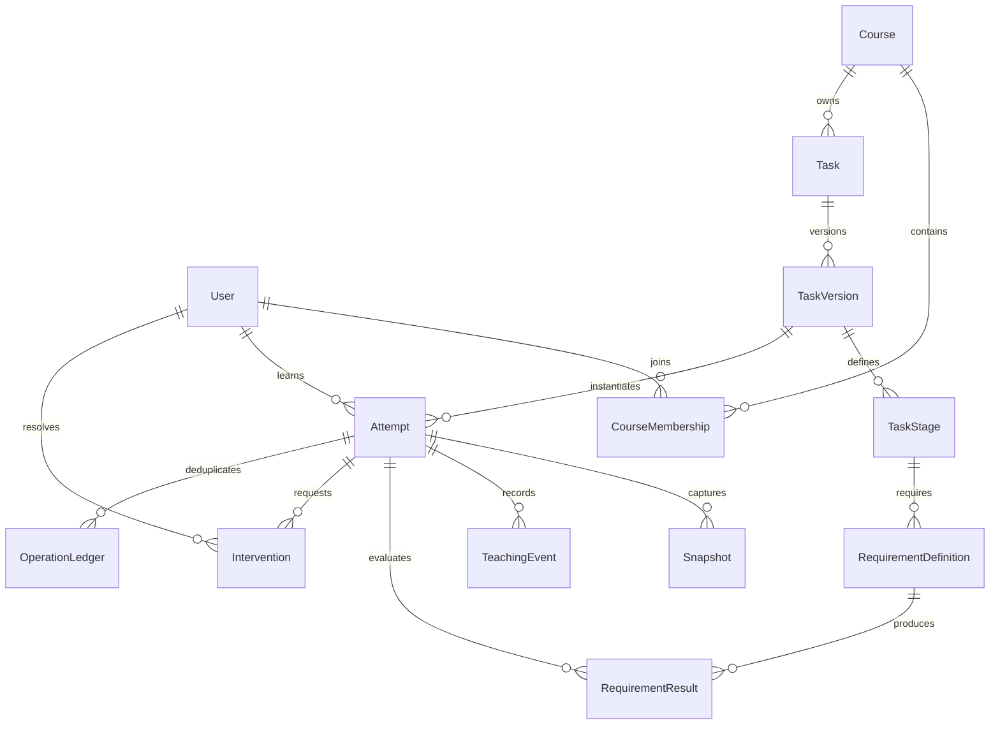
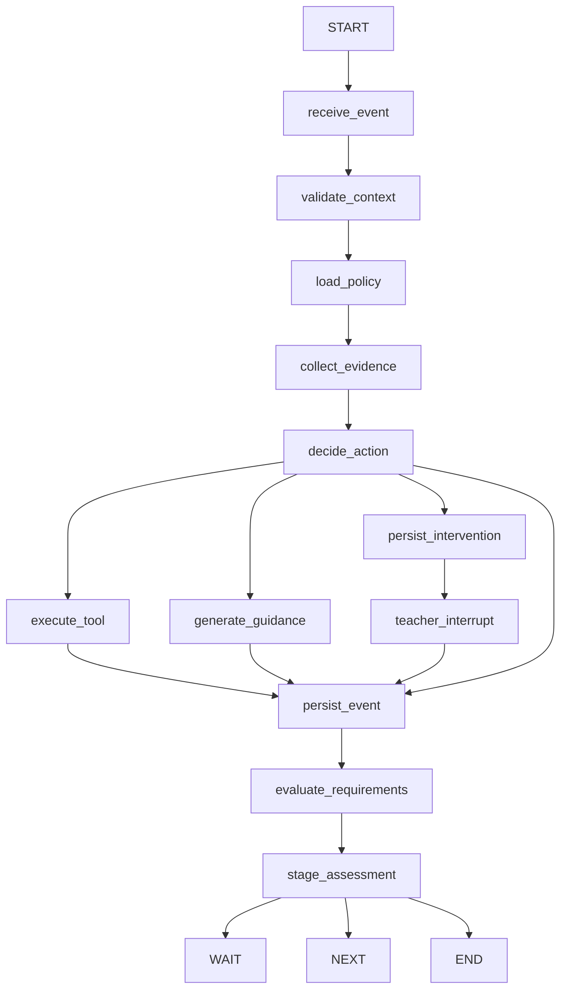
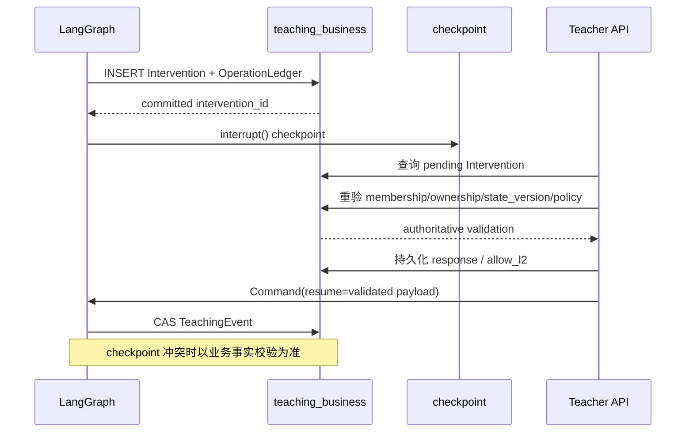

# 阶段 02A：业务事实层与 FAQ-001-v1 合同

## 数据库边界与权限

| role | 固定 search_path | 允许 | 禁止 |
| --- | --- | --- | --- |
| `teaching_app` | `teaching_business, public` | 业务表 CRUD | 查询或修改 `langgraph_checkpoint` |
| `langgraph_cp` | `langgraph_checkpoint, public` | checkpoint schema 的 USAGE/CREATE/读写 | 业务表读写 |

schema 由 `deploy/bootstrap-postgres.sql` 预先创建。Alembic 只管理 `teaching_business`，version table 为 `teaching_business.alembic_version`。Checkpoint 使用独立 `AsyncConnectionPool`，固定 `autocommit=True`、`prepare_threshold=0`、`row_factory=dict_row`；FastAPI worker 不调用 `setup()`，部署通过 `python scripts/init_checkpoint.py` 初始化。必须设置 `LANGGRAPH_STRICT_MSGPACK=true`。

## ER 图

`OperationLedger` 实际通过 `scope + operation_id` 关联副作用，不依赖 checkpoint。正式成绩表不在本阶段范围。

## Requirement 合同

`RequirementDefinition` 绑定不可变 `TaskVersion -> TaskStage`，含 `requirement_key`、`kind`、`required`、`evaluator`、`config`、`version`。类型为 `AUTO_TEST`、`STATIC_CHECK`、`STUDENT_EXPLANATION`、`TEACHER_REVIEW`、`TRANSFER_TASK`。

`RequirementResult` 必含 `requirement_id`、`status`、`evaluator`、`evidence_refs`、`evaluated_at`、`version`。`RequirementEvaluator` 只读取当前 Attempt 阶段的服务端定义与结果，采用 `ALL_REQUIRED` 聚合；客户端 `stage_requirements_met` 和正式成绩字段在入库前被丢弃。

## FAQ-001-v1

| 阶段 | RequirementDefinition |
| --- | --- |
| 理解需求 | 学生解释范围（STUDENT_EXPLANATION）；识别引用规则（STATIC_CHECK） |
| 准备资料 | 资料清单（STATIC_CHECK）；资料质量审核（TEACHER_REVIEW） |
| 实现检索 | 检索公开测试（AUTO_TEST）；检索观察（STUDENT_EXPLANATION） |
| 生成带来源回答 | 回答公开测试（AUTO_TEST）；引用静态检查（STATIC_CHECK） |
| 边界验证 | 未知问题测试（AUTO_TEST）；不可回答变式（TRANSFER_TASK） |
| 交付 | 交付清单（STATIC_CHECK）；教师交付审核（TEACHER_REVIEW） |

默认策略 `allow_auto_l2=false`。需要 L2 时进入教师介入；任务版本显式允许或教师 resume 明确 `allow_l2=true` 后才可生成 L2。assessment 最大帮助 L0，禁止答案型指导和代码补丁，只允许策略列出的安全 DIAGNOSTIC/EVALUATION 工具。

## API

| 方法 | 路径 | 用途 |
| --- | --- | --- |
| POST | `/api/task-versions` | 创建/幂等读取 FAQ-001-v1 |
| GET | `/api/task-versions/{id}` | 读取任务版本与阶段 |
| POST | `/api/attempts` | 创建当前用户 Attempt |
| GET | `/api/attempts/{id}` | 读取经归属校验的 Attempt |
| POST | `/api/attempts/{id}/events` | CAS 提交教学事件并服务端聚合 Requirement |
| GET | `/api/attempts/{id}/requirements` | 读取 RequirementResult |
| POST | `/api/attempts/{id}/interventions` | 创建业务 Intervention |
| GET | `/api/interventions` | 教师读取业务表中的待处理介入 |
| GET | `/api/interventions/{id}` | 读取介入证据 |
| POST | `/api/interventions/{id}/resolve` | 重验权限/归属/版本，持久化处理并调用已配置 Graph resume runtime |
| GET | `/api/attempts/{id}/events` | 读取业务 TeachingEvent 时间线 |

仅在 DEV/TEST 且显式 `DEV_AUTH_ENABLED=true` 时，身份可由 `X-User-Id` 映射到数据库用户；生产环境启用该方式会拒绝启动。角色、课程成员关系和对象归属全部从业务数据库读取。

## 更新后的 Graph

## interrupt / resume 时序

