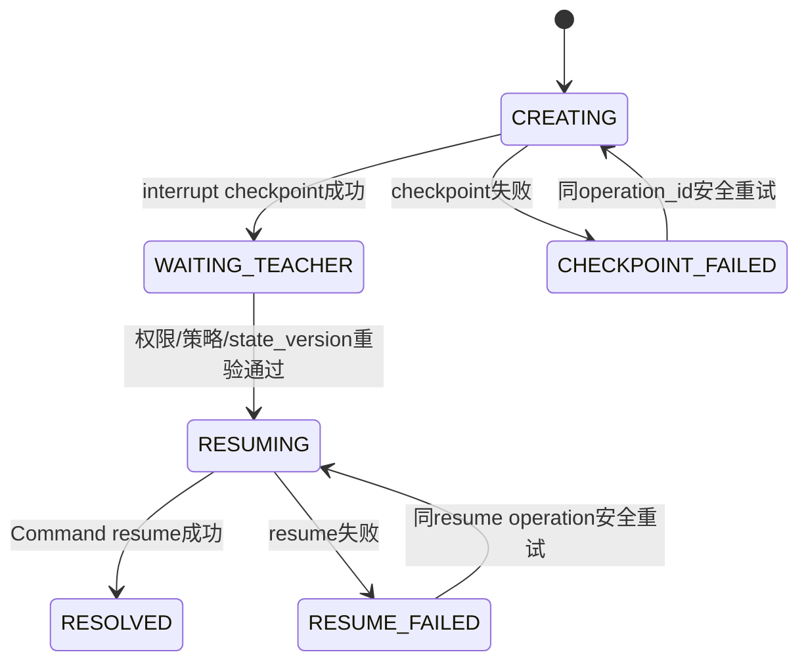
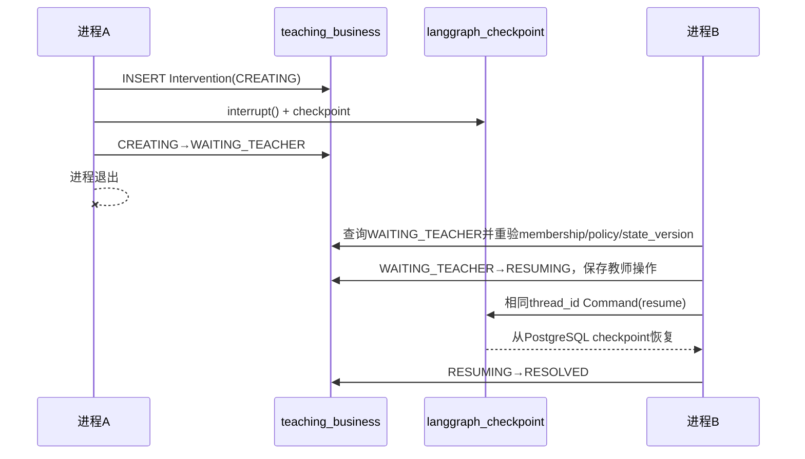

# Stage 02B：真实 PostgreSQL 与恢复门

## 运行边界

- 镜像：`docker.io/library/postgres:17.11-alpine3.24@sha256:f02121de6f74d30d8a94cd1d9584125e2178d7e6c377d8130112d4e52d867995`
- `linux/amd64` manifest：`sha256:aa90e97ee862e558111d34cfb8b2c4bec768c2b039fb791341686928560263b3`
- 容器：`teachingagent-postgres-02b`
- volume：`teachingagent-postgres-02b-data`
- 端口只绑定 `127.0.0.1`，由 Docker 随机分配。
- 测试凭据保存在用户临时目录，不写入项目或 Git。

Docker Desktop CLI 位于用户安装目录。普通 Codex 沙箱不能执行该二进制；Stage 02B 在获得宿主执行权限后固定使用本机 `dockerDesktopLinuxEngine` 命名管道。

## 业务与 checkpoint 边界

| role | search_path | 允许 | 实测拒绝 |
|---|---|---|---|
| `teaching_app` | `teaching_business, public` | 业务表 SELECT/INSERT/UPDATE/DELETE | checkpoint schema USAGE/查询 |
| `langgraph_cp` | `langgraph_checkpoint, public` | checkpoint schema USAGE/CREATE及表读写 | business schema USAGE/读/写 |

`deploy/bootstrap-postgres.sql` 可重复执行，并显式撤销 PUBLIC 对两个 schema 的权限。Alembic只管理 `teaching_business`；`AsyncPostgresSaver.setup()`只使用 `langgraph_cp`连接池。

Checkpoint pool固定：

```text
autocommit=True
prepare_threshold=0
row_factory=dict_row
LANGGRAPH_STRICT_MSGPACK=true
```

## Intervention状态合同



只有 `WAITING_TEACHER` 会进入教师正常待处理列表。`CHECKPOINT_FAILED` 不产生可点击事项；`RESUME_FAILED` 保留教师ID、回复和L2授权。`OperationLedger(scope, operation_id)`唯一约束保证创建和恢复副作用幂等。

## 跨进程恢复



进程B的待处理查询不创建 checkpoint pool；恢复时才建立独立 pool。业务事实与 checkpoint 冲突时，`begin_resume` 先以 Attempt 的 `state_version`、当前 TaskVersion 策略、课程成员关系和 Intervention 状态拒绝无效恢复。

## 认证临时边界

- `DEV_AUTH_ENABLED` 默认为关闭。
- 仅 `TEACHING_ENV=development/dev/test` 可启用开发身份头。
- production 或其他环境启用 `DEV_AUTH_ENABLED` 时，应用拒绝启动。
- 本阶段未实现 OAuth/JWT。

## 部署初始化

1. 由 PostgreSQL 管理员执行 `deploy/bootstrap-postgres.sql`。
2. 由迁移管理员设置 `TEACHING_ALEMBIC_DATABASE_URL` 并执行 `python -m alembic upgrade head`。
3. 设置 `LANGGRAPH_STRICT_MSGPACK=true` 和 checkpoint role连接串，单独执行 `python scripts/init_checkpoint.py`。
4. FastAPI worker不自动执行 checkpoint `setup()`。

Windows命令行入口显式使用 Selector event loop，以满足 Psycopg async 的运行要求。
