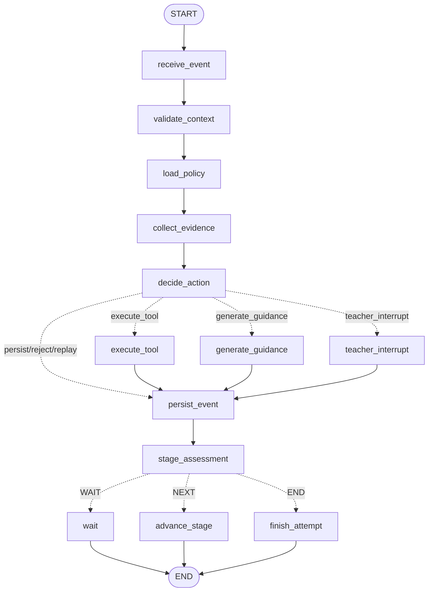

# 阶段 01：LangGraph 教学控制合同

## 1. 范围与权威边界

本阶段只验证教学状态机合同。`OpenHandsExecutorProtocol`、`TeachingLLMProtocol` 和业务事件存储均使用 Fake；不连接真实 Docker 工作区，不执行学生代码，不开发正式页面。

三类状态的边界如下：

| 载体 | 本阶段用途 | 权威性 | 不得保存的内容 |
| --- | --- | --- | --- |
| LangGraph State | 单次教学流程的有界上下文、路由结果、证据引用和恢复位置 | 非业务事实源，仅用于工作流推进和恢复 | 模型密钥、工作区令牌、完整代码、原始大日志、正式成绩 |
| 业务数据库 / `TeachingEventStoreProtocol` | 尝试、权限、策略版本、教学事件和状态版本的权威记录；以 compare-and-set 校验 `state_version` | 权威事实源 | 未经服务端校验的客户端权限或成绩 |
| 独立 Workspace / `OpenHandsExecutorProtocol` | 按 `snapshot_id` 和允许的工具执行隔离任务，返回结果引用与有界摘要 | 文件和运行产物源，不决定教学阶段 | 教学策略、阶段推进权、正式成绩 |

测试使用 `InMemorySaver` 作为 LangGraph checkpointer。它只验证 interrupt/resume 行为，进程退出即丢失，不能作为正式课堂的持久化方案。正式环境需要可持久化、可备份、可并发控制的 checkpointer，并继续以业务数据库为权威源；阶段 01 不增加 SQLite/PostgreSQL checkpoint 专用包。

## 2. TeachingState 完整字段

| 字段 | 类型 | 责任与约束 |
| --- | --- | --- |
| `attempt_id` | `str` | 业务尝试标识，由服务端绑定 |
| `task_version` | `str` | 任务定义版本；事件必须严格匹配 |
| `learner_id` | `str` | 当前学生标识；用于服务端授权校验 |
| `authorized_teacher_ids` | `list[str]` | 本阶段用于教师恢复授权；正式环境应从业务数据库重新读取 |
| `state_version` | `int` | 乐观并发版本；事件与教师恢复均必须匹配 |
| `policy_version` | `str` | 教学策略版本引用 |
| `current_stage` | `str` | 当前教学阶段，仅图和业务规则可推进 |
| `stage_index` | `int` | 当前阶段在序列中的位置 |
| `stage_sequence` | `list[str]` | 固化的任务阶段序列 |
| `mode` | `guided_practice \| teacher_demo \| assessment` | 教学模式；`assessment` 强制收紧帮助策略 |
| `teacher_policy` | `TeachingPolicy` | 教师配置的原始策略 |
| `effective_policy` | `TeachingPolicy` | 合并硬规则和模式限制后的服务端策略 |
| `incoming_event` | `TeachingEvent` | 当前有界事件；含 `operation_id`、版本和证据引用 |
| `event_replayed` | `bool` | 当前业务操作是否已处理 |
| `latest_snapshot_id` | `str \| None` | 工作区快照引用，不保存工作区内容 |
| `evidence_refs` | `list[str]` | 最多 16 个证据引用 |
| `evidence_summary` | `str` | 最多 512 字符的证据摘要 |
| `student_observation` | `str \| None` | 最多 512 字符的学生观察 |
| `latest_check_status` | `not_run \| passed \| student_failure \| infrastructure_failure` | 最近检查分类；基础设施失败单独计数 |
| `stage_requirements_met` | `bool` | 当前阶段的服务端验收条件是否满足 |
| `student_failure_count` | `int` | 只累计学生原因失败 |
| `infrastructure_failure_count` | `int` | 单独累计基础设施失败 |
| `help_level` | `NONE \| L0 \| L1 \| L2` | 由硬规则、模式、策略、阶段和证据决定 |
| `decision` | `TeachingDecision` | 显式路由决定及原因 |
| `processed_operation_ids` | `list[str]` | 最近 32 个副作用操作标识，用于有界幂等判断 |
| `last_tool_result_ref` | `str \| None` | OpenHands 结果引用 |
| `last_tool_status` | `str \| None` | OpenHands 有界状态，不含大日志 |
| `guidance` | `GuidanceRecord \| None` | 已生成的分层指导记录 |
| `pending_intervention` | `InterventionRecord \| None` | 可恢复教师介入的标识、原因和请求版本 |
| `teacher_resume` | `TeacherResume \| None` | 恢复后经校验的教师信息与响应 |
| `persistence` | `PersistenceReceipt \| None` | 业务事件持久化回执 |
| `stage_assessment` | `StageAssessment` | 阶段推进建议，不是正式成绩 |
| `flow_status` | `FlowStatus` | 运行、等待、完成或拒绝状态 |
| `error_code` | `str \| None` | 稳定的策略拒绝码 |

策略字段为：`failure_threshold`、`max_help_level`、`require_observation_for_l1`、`allow_answer_guidance`、`allow_code_patch`、`allowed_tools`。`assessment` 模式无条件把最大帮助收紧至 L0，并禁用答案型指导和代码补丁。

## 3. 实际编译 Graph

`teacher_interrupt` 调用 LangGraph `interrupt()`，立即把可恢复状态交给 checkpointer，不占用阻塞线程。教师继续使用 `Command(resume=...)`；节点重新校验教师角色、教师分配关系和 `expected_state_version`，之后才持久化原事件。

## 4. Node 输入与输出

| Node | 主要输入 | 主要输出 / 副作用 |
| --- | --- | --- |
| `receive_event` | `incoming_event`、已处理操作 ID | 校验必填和有界载荷；标记重放；清理上次瞬态输出 |
| `validate_context` | 事件与 attempt/task/student/state 绑定 | 通过或抛出授权、任务版本、状态版本错误 |
| `load_policy` | 模式、教师策略、策略版本 | `effective_policy`；assessment 硬覆盖 |
| `collect_evidence` | 证据引用、摘要、观察、检查结果 | 有界证据、检查分类、分离的失败计数 |
| `decide_action` | 硬规则、模式、有效策略、当前阶段、证据 | 确定性 `decision`、帮助级别、拒绝码或介入请求 |
| `execute_tool` | 已允许工具、snapshot 引用、阶段 | 调用 OpenHands Protocol；写结果引用与状态；使用 `tool:<event operation_id>` |
| `generate_guidance` | 服务端选定级别/类型、证据 | 调用 LLM Protocol 仅渲染文本；使用 `guidance:<event operation_id>` |
| `teacher_interrupt` | 待介入记录、状态版本、证据引用 | `interrupt()`；resume 后重新校验权限和版本并记录教师响应 |
| `persist_event` | 当前决定、阶段、证据引用、检查状态 | 业务事件 CAS；使用 `persist:<event operation_id>`；更新 `state_version` |
| `stage_assessment` | 持久化后的检查状态和阶段条件 | `WAIT`、`NEXT` 或 `END`；不产生正式成绩 |
| `wait` | 决定和验收结果 | `WAITING_FOR_STUDENT` 或 `REJECTED` |
| `advance_stage` | 通过的阶段验收 | CAS 记录阶段推进；使用 `advance:<event operation_id>:<index>` |
| `finish_attempt` | 通过的末阶段验收 | CAS 记录完成；使用 `finish:<event operation_id>`；正式成绩保持未设置 |

## 5. Router 条件

### `route_decision`

| 条件 | 路由 |
| --- | --- |
| 重放操作，或基础设施失败只需记录 | `persist_event` |
| assessment/策略禁止答案、补丁或工具 | `persist_event`，事件记录为 `reject` |
| 学生失败达到教师策略阈值 | `teacher_interrupt` |
| 学生失败未达阈值，或安全的指导请求 | `generate_guidance` |
| 请求工具在有效策略白名单中 | `execute_tool` |
| 其余无需外部动作的事件 | `persist_event` |

失败后的帮助层级由规则选择：首次或无有效观察为 L0；至少两次失败且有有效观察为 L1；至少三次失败且有有效观察可为 L2，但始终受模式和教师 `max_help_level` 限制。达到 `failure_threshold` 时教师介入优先于继续升级帮助。

### `route_assessment`

| 条件 | 路由 |
| --- | --- |
| 重放、拒绝、基础设施失败、检查未通过或阶段要求未满足 | `WAIT` |
| 检查通过且阶段要求满足，并且不是最后阶段 | `NEXT` |
| 检查通过且阶段要求满足，并且是最后阶段 | `END` |

## 6. Adapter 合同

- `OpenHandsExecutorProtocol` 只接收已选定的工具、阶段和快照引用，只返回执行状态、结果引用和摘要；它没有阶段推进接口。
- `TeachingLLMProtocol` 只接收服务端已选定的模式、帮助级别、指导类型和证据；返回值没有正式成绩或路由字段。适配器若改变帮助级别或指导类型，图会拒绝结果。
- `TeachingEventStoreProtocol` 对 `attempt_id + expected_state_version` 执行 compare-and-set，并以 `operation_id` 去重。Fake 只供测试，不能替代业务数据库。
- 正式成绩不进入图的决定合同；阶段通过只产生流程推进建议，成绩必须由业务服务按量规和教师权限生成。

## 7. 幂等与恢复合同

每个外部副作用都使用稳定 `operation_id` 前缀。事件重放时不再次调用 OpenHands、LLM 或业务持久化；事件存储自身也维护 operation ledger 作为第二道防线。Graph State 只保留最近 32 个操作 ID，正式去重事实必须由业务数据库长期保存。

恢复要求同时满足：LangGraph 存在对应 interrupt checkpoint、恢复者具有教师角色、教师被分配到该 attempt、恢复载荷的 `expected_state_version` 等于 checkpoint 状态版本、业务事件 CAS 仍成功。任一版本检查失败均拒绝恢复或持久化。
