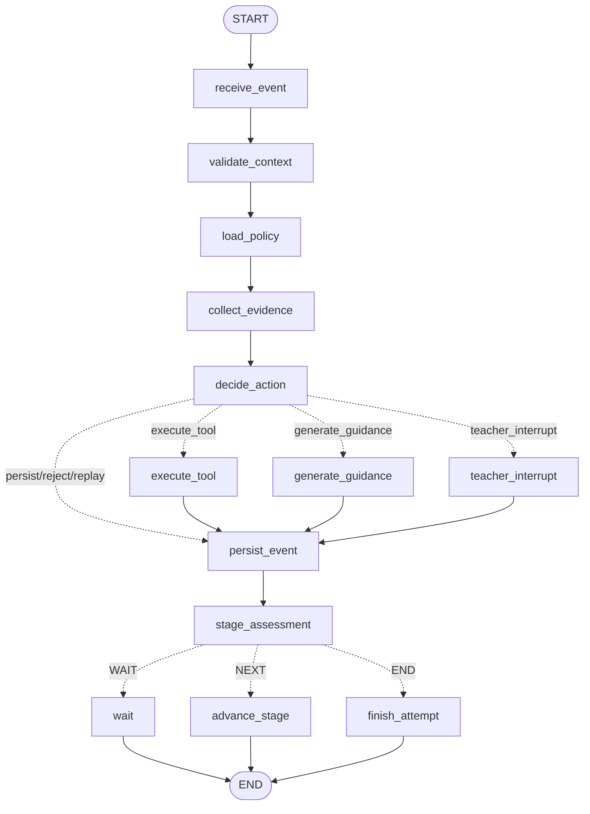

# 阶段 01 完成报告：LangGraph 教学控制最小合同

日期：2026-09-20  
范围：项目治理、依赖受控安装、LangGraph 教学状态机最小合同与 Fake 验证  
结论：阶段 01 要求已实现并通过验证；未进入阶段 02。

## 1. Git 基线与治理

| 项目 | 结果 |
| --- | --- |
| 初始 baseline commit | `415afacdf86c56b3f38988ab3fdb6178b884d3d4` |
| 治理文件提交 | `1e52c2d05554b447b775421e703a5a12c27db10c` |
| skills / 依赖提案提交 | `eaef4492e76d3214a6517e73578017d33980d2b4` |
| 阶段 01 实现提交 | `6b40189f7835e2529f44bfcbe3f8520b99afc921` |
| 分支 | `main` |
| `git status --short` | 无输出，工作区干净 |
| hooks | 未启用；只有 Git 默认 `*.sample` 文件 |

根目录已落位审核后的 `AGENTS.md`、`PRODUCT.md`、`DESIGN.md`，没有覆盖第三方依赖中的同名文件。新 Codex 会话确认 `impeccable` 和 `design-taste-frontend` 均可发现；Impeccable 有两个包含 `..` 的图标路径被 Codex 忽略，但 skill 本体可发现，本阶段没有启用 hooks。

## 2. 代码树

```text
D:\TeachingAgent
├─ AGENTS.md
├─ PRODUCT.md
├─ DESIGN.md
├─ backend
│  ├─ pyproject.toml
│  ├─ uv.lock
│  ├─ app
│  │  └─ teaching_control
│  │     ├─ __init__.py
│  │     ├─ errors.py
│  │     ├─ fakes.py
│  │     ├─ graph.py
│  │     ├─ protocols.py
│  │     └─ state.py
│  └─ tests
│     └─ teaching_control
│        └─ test_graph.py
├─ docs
│  └─ teaching-control-stage01.md
└─ reports
   ├─ 00-baseline.md
   ├─ 00-risks.md
   ├─ 01-governance-review.md
   ├─ 01-langgraph-dependency-proposal.md
   ├─ 01-skill-discovery.md
   └─ 01-stage-report.md
```

## 3. 实际依赖变化

直接依赖只增加一项：

```toml
"langgraph==1.2.11"
```

相对 baseline 的实际锁文件差异为 `backend/uv.lock +297/-0`，与预演锁文件 SHA-256 `4231E632D3FDFA87BD9CCB3CDF1AB7E366D2D0EE41BF1C53A3B610FA3D2DFBC7` 一致。锁文件新增 18 个记录：

| 新增包 | 版本 |
| --- | --- |
| `httpcore2` | 2.13.0 |
| `httpx2` | 2.13.0 |
| `httpx2-jsfetch` | 1.0 |
| `jsonpatch` | 1.33 |
| `jsonpointer` | 3.1.1 |
| `langchain-core` | 1.6.3 |
| `langchain-protocol` | 0.0.19 |
| `langgraph` | 1.2.11 |
| `langgraph-checkpoint` | 4.2.0 |
| `langgraph-prebuilt` | 1.1.0 |
| `langgraph-sdk` | 0.4.4 |
| `langsmith` | 0.13.0 |
| `ormsgpack` | 1.12.2 |
| `requests-toolbelt` | 1.0.0 |
| `truststore` | 0.10.4 |
| `uuid-utils` | 0.17.1 |
| `xxhash` | 4.0.1 |
| `zstandard` | 0.25.0 |

核对结果：现有包升级 0、降级 0、删除 0。`openhands-sdk`、`openhands-tools`、`openhands-workspace`、`openhands-agent-server` 均保持 `1.49.2`。实际 Windows 环境安装 17 个包；`httpx2-jsfetch` 是其他平台使用的锁记录，没有安装到本机环境。虽然 `langgraph-prebuilt` 作为传递依赖存在，教学控制实现没有导入或使用预制 Agent。

## 4. TeachingState 完整字段

共 34 个字段：

| 领域 | 字段 |
| --- | --- |
| 身份与并发 | `attempt_id`, `task_version`, `learner_id`, `authorized_teacher_ids`, `state_version`, `policy_version` |
| 阶段与策略 | `current_stage`, `stage_index`, `stage_sequence`, `mode`, `teacher_policy`, `effective_policy` |
| 当前事件与证据 | `incoming_event`, `event_replayed`, `latest_snapshot_id`, `evidence_refs`, `evidence_summary`, `student_observation`, `latest_check_status`, `stage_requirements_met`, `student_failure_count`, `infrastructure_failure_count` |
| 决策与副作用引用 | `help_level`, `decision`, `processed_operation_ids`, `last_tool_result_ref`, `last_tool_status`, `guidance`, `pending_intervention`, `teacher_resume`, `persistence` |
| 验收与流程 | `stage_assessment`, `flow_status`, `error_code` |

完整类型、枚举和字段约束见 `docs/teaching-control-stage01.md`。State 明确排除模型密钥、工作区令牌、完整代码、原始大日志和正式成绩；证据引用最多 16 个，摘要与学生观察各最多 512 字符，State 中幂等操作窗口最多 32 项。

## 5. Graph

实现直接使用 `StateGraph`、`Command`、`interrupt`、调用方提供的 checkpointer 和显式 conditional edges。



教师介入通过 `interrupt()` 保存可恢复状态；恢复使用 `Command(resume=...)`，不阻塞工作线程。测试传入 `InMemorySaver`，只用于阶段 01 验证，不是正式课堂持久化方案，也没有新增 SQLite/PostgreSQL checkpoint 专用包。

## 6. Node 输入与输出

| Node | 输入 | 输出 / 副作用 |
| --- | --- | --- |
| `receive_event` | 当前事件、已处理 ID | 必填/大小校验、重放标记、清理瞬态结果 |
| `validate_context` | attempt、任务版本、学生、状态版本 | 授权与版本通过，或显式异常 |
| `load_policy` | 模式、教师策略 | 有效策略；assessment 强制 L0 且禁答案/补丁 |
| `collect_evidence` | 引用、摘要、观察、检查结果 | 有界证据、检查状态、分离的学生/基础设施计数 |
| `decide_action` | 硬规则、模式、教师策略、当前阶段、证据 | 确定性决定、帮助级别、拒绝码或教师介入 |
| `execute_tool` | 白名单工具、快照、阶段 | Fake OpenHands 结果引用；`tool:<operation_id>` |
| `generate_guidance` | 已选级别/类型、证据 | Fake LLM 文本；`guidance:<operation_id>` |
| `teacher_interrupt` | 介入记录、版本、证据 | interrupt；resume 后重新验证角色、教师分配和版本 |
| `persist_event` | 决定、阶段、检查与证据引用 | Fake Store CAS；`persist:<operation_id>`；版本递增 |
| `stage_assessment` | 检查状态、阶段要求 | `WAIT` / `NEXT` / `END`，不产生正式成绩 |
| `wait` | 决定 | 等待学生或拒绝状态 |
| `advance_stage` | 已通过验收 | CAS 阶段推进；`advance:<operation_id>:<index>` |
| `finish_attempt` | 已通过末阶段验收 | CAS 完成；`finish:<operation_id>`，成绩仍未设置 |

## 7. Router 条件

`route_decision`：

| 优先级 | 条件 | 目标 |
| --- | --- | --- |
| 1 | operation 重放 | `persist_event`，存储 Fake 去重且不再次产生副作用 |
| 2 | assessment/有效策略禁止答案、代码补丁或工具 | `persist_event`，决定标记为 `reject` |
| 3 | 基础设施失败 | `persist_event`，不增加学生失败数 |
| 4 | 学生失败数达到教师阈值 | `teacher_interrupt` |
| 5 | 学生失败未达阈值 | `generate_guidance`；按证据选择 L0/L1/L2 并受策略上限约束 |
| 6 | 安全指导请求 | `generate_guidance` |
| 7 | 工具在有效策略白名单 | `execute_tool` |
| 8 | 其余事件 | `persist_event` |

`route_assessment`：

| 条件 | 目标 |
| --- | --- |
| 重放、拒绝、基础设施失败、检查未通过、阶段要求未满足 | `WAIT` |
| 检查通过且阶段要求满足，当前不是末阶段 | `NEXT` |
| 检查通过且阶段要求满足，当前是末阶段 | `END` |

LLM 只渲染服务端已选定的帮助级别和指导类型；返回值改变这两项时适配器拒绝。OpenHands 只执行已允许的工具并返回结果引用，没有阶段推进接口。正式成绩不在两个 Protocol 的输入或输出中。

## 8. 测试结果

| 编号 | 覆盖项 | 用例 / 结果 |
| --- | --- | --- |
| A | 初次任务失败 → L0 | `test_a_initial_failure_selects_l0`：通过 |
| B | 有效观察后再次失败 → L1 | `test_b_second_failure_with_valid_observation_selects_l1`：通过 |
| C | 达阈值 → teacher interrupt | `test_c_failure_threshold_creates_recoverable_teacher_interrupt`：通过 |
| D | 教师 resume，重新验证权限和版本 | 合法恢复与未授权教师拒绝两个用例：通过 |
| E | assessment 禁止答案型提示 | `test_e_assessment_mode_rejects_answer_style_guidance`：通过 |
| F | assessment 禁止代码 patch | `test_f_assessment_mode_rejects_code_patch`：通过 |
| G | infrastructure failure 不累计学生失败 | `test_g_infrastructure_failure_does_not_increment_student_failure`：通过 |
| H | 同 operation_id 重放无重复副作用 | `test_h_replayed_operation_id_does_not_repeat_side_effect`：通过 |
| I | 旧 state_version resume 被拒绝 | `test_i_stale_state_version_resume_is_rejected`：通过 |
| J | 验收通过后才能推进阶段 | `test_j_stage_advances_only_after_passing_assessment`：通过 |

额外测试验证 State 与两个适配器不包含密钥、完整代码、大日志、正式成绩或越权阶段字段。

最终验证：

| 命令 | 结果 |
| --- | --- |
| `uv pip check --python backend\.venv\Scripts\python.exe` | 215 个包兼容，通过 |
| `scripts/check-dependencies.ps1` | 后端依赖、FastAPI smoke、学生端和教师端 Vite production build、`npm ls` 全部通过 |
| OpenHands 版本断言 | 四个组件均为 1.49.2，通过 |
| LangGraph import/minimal graph | `StateGraph`、`Command`、`interrupt`、`InMemorySaver` 导入和最小图运行通过 |
| `ruff check --no-cache app/teaching_control tests/teaching_control` | 通过 |
| `pytest -q -p no:cacheprovider tests/teaching_control` | 12 passed |
| 完整后端 `pytest -q -p no:cacheprovider` | 15 passed |
| 锁文件程序化比较 | 新增 18、版本变化 0、删除 0，通过 |

验证过程中的实际异常均已保留：受限沙箱首次无法写 `.ruff_cache`、`.pytest_cache` 和 uv cache；改用无缓存参数或以项目目录权限重跑后通过。Ruff 初次发现导入排序和多余空行，修复后最终通过。没有把这些中间失败记为成功。

## 9. 未完成项与风险

1. `InMemorySaver` 在进程退出后丢失，只能用于测试。正式课堂必须选择持久化 checkpointer，并定义备份、清理和并发策略。
2. `FakeTeachingEventStore` 不是业务数据库；正式实现必须持久化 operation ledger，执行数据库级 CAS，并在教师 resume 时重新读取最新权限、策略和版本。
3. `FakeOpenHandsExecutor` 不启动 Docker，不执行真实学生代码。工作区隔离、资源限制、网络策略、超时、快照与日志引用仍待后续阶段实现。
4. `FakeTeachingLLM` 不连接真实模型。正式适配器仍需结构化输出校验、超时/重试、内容策略和成本预算。
5. `stage_requirements_met` 当前由受信服务事件提供；后续必须由版本化任务检查器计算，客户端不得直接设置。
6. Graph 中最近 operation ID 仅保留 32 项以限制状态大小；长期幂等事实必须由业务数据库保存。
7. 本阶段没有 API 接线、数据库迁移、正式 UI、生产部署、并发/故障恢复压测或正式成绩逻辑。
8. `authorized_teacher_ids` 在测试 State 中用于验证合同；正式课堂不能把 checkpoint 中的列表作为最终授权源。

## 10. 阶段 02 进入条件

阶段 02 开始前需由项目负责人确认：

- 接受当前 34 字段 State 和数据库/Graph/Workspace 边界；
- 接受 assessment 模式硬限制和 L0/L1/L2 升级规则；
- 选择正式业务数据库与持久化 checkpointer 方案；
- 明确首个 FAQ 任务的版本化验收规则及 `stage_requirements_met` 的服务端计算来源；
- 确认下一阶段是否先接 API/数据库，或先实现真实 OpenHands 沙箱适配器。

本报告完成后停止，不自动进入阶段 02。
