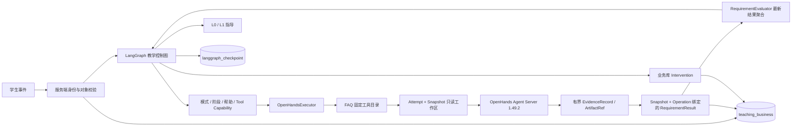
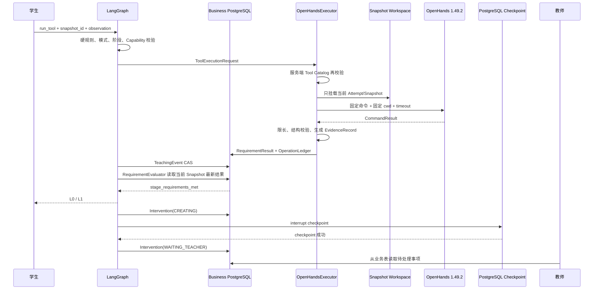

# Stage 03 — 真实 OpenHands 实训执行闭环报告

验证时间：2026-09-20（Asia/Shanghai）  
范围：仅 FAQ-001-v1；未开发正式 UI，未扩展其他课程场景。

## 1. 更新后的架构



权力边界保持不变：LangGraph 决定教学阶段、模式、帮助级别、工具授权、教师介入和阶段推进；OpenHands 只执行服务端已经批准的固定工具并返回证据。OpenHands 结果中没有阶段、帮助级别或正式成绩字段。TeachingLLM 只渲染服务端已经选择的指导级别，本阶段真实闭环使用确定性 FakeTeachingLLM，未让模型参与路由或成绩判定。

## 2. LangGraph → OpenHands 时序



## 3. OpenHandsExecutor 合同

`ToolExecutionRequest` 必须包含：

| 字段 | 约束 |
|---|---|
| `attempt_id` | 来自服务端已授权 Attempt |
| `task_version` | 当前仅允许 `FAQ-001-v1` |
| `stage` | 仅作为执行上下文；OpenHands 无权修改 |
| `snapshot_id` | 必须属于当前 Attempt，且验收时必须是最新 Snapshot |
| `operation_id` | 外部副作用幂等键 |
| `tool_name` | 必须存在于服务端固定目录 |
| `tool_capability` | 必须与目录声明完全相同，客户端伪造会被拒绝 |
| `timeout_seconds` | 必须大于 0 且不超过该工具服务端上限 |
| `resource_policy` | 1 CPU、1 GiB、128 PIDs、internal-only、有界输出 |

`ToolExecutionResult` 只返回 `status`、有界 `summary`、`output_ref`、`EvidenceRecord` 和 `duplicate`。每条 Evidence 重新绑定 request 的 Attempt、TaskVersion、Snapshot、Operation、Tool；任何绑定不一致或结构异常都会在入库前拒绝。

`ArtifactRef` 记录 URI、类型、SHA-256、字节数和媒体类型。完整 stdout、完整代码和大日志不进入 LangGraph State；证据文件位于未向学生容器挂载的宿主证据目录。

## 4. 工具目录与 Capability

| Tool | Capability | 上限 | 教学用途 |
|---|---|---:|---|
| `inspect_workspace` | DIAGNOSTIC | 30 s | 必需文件、资料 JSON、至少 3 条资料 |
| `run_student_program` | DIAGNOSTIC | 30 s | 运行学生 FAQ 程序并采集运行证据 |
| `run_faq_tests` | EVALUATION | 45 s | 资料加载、已知问题命中、未知问题不伪造、基础引用 |
| `validate_retrieval` | EVALUATION | 45 s | 检索专项验收 |
| `validate_citations` | EVALUATION | 45 s | 引用字段专项验收 |
| `inspect_runtime_error` | DIAGNOSTIC | 30 s | Python 编译/运行错误诊断 |

本阶段没有注册 MODIFICATION、GENERATION 或 ADMIN 工具。assessment 仍只允许服务端策略批准的 DIAGNOSTIC / EVALUATION；已有图测试验证 MODIFICATION 会在执行器调用前被拒绝。

## 5. FAQ Requirement → Tool 映射

| 阶段 / Requirement | 类型 | Stage 03 处理 |
|---|---|---|
| 理解需求 / `explain_scope` | STUDENT_EXPLANATION | 服务端人工/文本合同，未交给 OpenHands |
| 理解需求 / `identify_citation_rule` | STATIC_CHECK | 尚未自动化，不能被通用文件检查误判为通过 |
| 准备资料 / `source_manifest` | STATIC_CHECK | `inspect_workspace`，已真实验证 SATISFIED |
| 准备资料 / `source_quality_review` | TEACHER_REVIEW | 教师事实，不交给 OpenHands |
| 实现检索 / `retrieval_public_tests` | AUTO_TEST | `run_faq_tests`；也允许服务端选择 `validate_retrieval` |
| 实现检索 / `retrieval_observation` | STUDENT_EXPLANATION | 学生观察合同 |
| 生成带来源回答 / `answer_public_tests` | AUTO_TEST | 未在本阶段自动落正式结果 |
| 生成带来源回答 / `citation_static_check` | STATIC_CHECK | `validate_citations` |
| 边界验证 / `unknown_question_test` | AUTO_TEST | `run_faq_tests` 的未知问题检查 |
| 边界验证 / `boundary_transfer` | TRANSFER_TASK | 未自动化 |
| 交付 / `delivery_static_check` | STATIC_CHECK | 未自动化 |
| 交付 / `delivery_review` | TEACHER_REVIEW | 教师事实，不交给 OpenHands |

自动映射按 `requirement_key` 白名单执行，未实现的 Requirement 不会因 evaluator 名相似而被误写为 SATISFIED。

## 6. Workspace 资源与安全策略

| 项目 | 实际策略 |
|---|---|
| Attempt 隔离 | Attempt ID 经过 SHA-256 派生目录；每个 Attempt 独立 source/snapshots |
| Snapshot | 从 source 复制；拒绝符号链接；执行时只读挂载到 `/workspace/student` |
| 其他宿主挂载 | 无；Docker socket 未挂载 |
| Agent 临时数据 | `/workspace/conversations` 位于容器临时层，不在学生 Snapshot |
| CPU / 内存 / swap | 1 CPU；1 GiB；swap 总上限 1 GiB |
| 进程数 | 128 |
| 超时 | Tool 服务端上限 30/45 s；单任务可进一步收紧 |
| 输出 | stdout/stderr 各 16 KiB，超限截断并标记 |
| Linux 权限 | `cap-drop=ALL`，`no-new-privileges:true` |
| 网络 | 学生/Agent 容器只接 `teachingagent-stage03-internal`，真实外网探针失败 |
| 本机 API | 固定目标 TCP 侧车绑定 `127.0.0.1` 随机端口；侧车无 Workspace、无模型密钥，只转发到当前 Agent Server |
| 密钥 | 不传 DeepSeek/OpenAI/Anthropic/系统主密钥；学生命令环境显式移除主密钥名和 OpenHands 会话令牌；实际环境变量探针通过 |

真实 Docker inspect 记录：Memory 1,073,741,824 bytes、NanoCPUs 1,000,000,000、PidsLimit 128、CapDrop `ALL`、一个只读 bind mount、无 Docker socket。镜像自身声明 8000/tcp，但 Agent 容器没有直接宿主绑定；localhost 入口由固定目标侧车提供。

## 7. 真实学生错误案例时间线

最终验证 Attempt：`74dcd5ee-7f14-43bd-bea3-000cf622bce3`  
Snapshot：`80b5b028-08d4-4c4f-86e5-6cb6792cf3a3`

| state_version | 事件 | 真实结果 | 后续教学决策 |
|---:|---|---|---|
| 1 | 第一次 `run_faq_tests` | sources_loaded 通过；known_question_hit 失败；`empty_retrieval` | 记录 student failure 1 |
| 2 | 系统后续事件 | 当前 Snapshot 的 RequirementResult 未满足 | L0 提问式指导 |
| 3 | 学生提交有效观察后再次运行 | 仍为 `empty_retrieval` | 记录 student failure 2 |
| 4 | 系统后续事件 | 有效观察继续保留在 State | L1 定位提示 |
| 5 | 第三次运行 | 仍失败；业务计数达到 3 | 先写 Intervention，再写 checkpoint，进入 `WAITING_TEACHER` |

Process A PID 38132 在 L0 后退出；Process B PID 40216 仅凭业务 PostgreSQL、相同 thread ID 和 PostgreSQL checkpoint 恢复，完成 L1 与 interrupt。没有复用 Process A 内存对象。

## 8. RequirementResult 样例

```json
{
  "requirement_id": "ea9186b5-356b-4f0c-ae50-7f3fb42e6f94",
  "snapshot_id": "80b5b028-08d4-4c4f-86e5-6cb6792cf3a3",
  "operation_id": "tool:stage03-third-1351731d",
  "status": "NOT_SATISFIED",
  "evaluator": "openhands:run_faq_tests:v1",
  "evidence_refs": [
    "artifact://94054bc1acd6d55404a6c524/cc46f8e029424896a9a9ff1fc8c6a77fc7ab5c5e70ac9ce7848e23b6510f67d4"
  ],
  "evaluated_at": "2026-09-20T04:55:17.086386+00:00",
  "version": 1
}
```

同一 Snapshot 的三次真实执行各自保留一条不可变 RequirementResult。聚合器只读取当前最新 Snapshot，并按 Requirement 取最新结果；旧 Snapshot 和旧 Evidence 可查但不能验收新代码。

## 9. 测试与验证结果

| 检查 | 结果 |
|---|---|
| Ruff：backend app/tests/migrations | 通过 |
| 全部 backend pytest | 34 passed |
| Alembic `0001 → 0002 → 0001 → 0002` | 真实 PostgreSQL 通过，最终 head `20260920_0002` |
| Process A → Process B checkpoint 恢复 | 通过 |
| FAQ AUTO_TEST | 真实 OpenHands 返回 `empty_retrieval`，3 条 NOT_SATISFIED 历史 |
| FAQ STATIC_CHECK | `source_manifest` 真实 SATISFIED；教师复核未完成，阶段未推进 |
| 同 operation_id 重放 | `duplicate=true`，Evidence artifact 数量 3 → 3 |
| OpenHands 超时 | `execution_timeout` / infrastructure_failure |
| 超时计数 | business + graph：student 0，infrastructure 1 |
| Workspace 启动失败 | infrastructure_failure / `workspace_start_failed` |
| 旧 Snapshot 污染 | 单元/业务合同拒绝 `stale_snapshot` |
| 异常结构 | 入库前抛出 ToolResultValidationError |
| A/B Workspace 隔离 | 真实探针 + 路径隔离测试通过 |
| 路径穿越 | `../` snapshot ID 被拒绝 |
| Docker socket | 真实探针不可见；inspect 显示未挂载 |
| 主模型密钥 | 真实容器环境无 LLM/DeepSeek/OpenAI/Anthropic 主密钥 |
| 超大输出 | 真实执行截断并设置 `stdout_truncated=true` |
| assessment MODIFICATION | 服务端策略测试通过，执行器未被调用 |
| 伪造 tool/capability | 服务端 Tool Catalog 拒绝 |

真实机器报告保存在 `reports/stage03-real-verification.json`。

## 10. 代码树

```text
backend/
  app/
    agent/
      tools.py                 # OpenHandsExecutor、FAQ 工具目录、证据合同
      workspace.py             # Attempt/Snapshot 隔离与受限容器
    business/
      stage03.py               # PostgreSQL 适配器与持久化教学 Runtime
      models.py                # Snapshot/Operation 绑定 RequirementResult
      requirements.py          # 当前 Snapshot 最新结果聚合
      service.py               # Snapshot 注册、不可变结果、CAS
    teaching_control/
      protocols.py             # Request/Result/Evidence/Artifact/ResourcePolicy
      graph.py                 # Capability、执行、结果记录、后续教学决策
  migrations/versions/
    20260920_0002_stage03_snapshot_evidence.py
  tests/
    agent/test_openhands_executor.py
    business/test_stage03_snapshot_contract.py
scripts/
  stage03-real-flow.py         # 两进程真实闭环与安全验证
reports/
  stage03-real-verification.json
  STAGE03-REPORT.md
```

## 11. 依赖变化

Stage 03 没有新增、升级、降级或删除依赖。OpenHands 四组件保持 1.49.2，LangGraph 保持 1.2.11。`uv.lock` 未修改。

## 12. 风险与未完成项

- 当前执行目录和验收工具只支持 FAQ-001-v1；未泛化其他课程、YOLO 或任意命令。
- `answer_public_tests`、`identify_citation_rule`、`delivery_static_check` 和 TRANSFER_TASK 尚未实现自动验收；白名单不会让它们被相似工具误判为通过。
- 正式 UI 未开发；MODIFICATION / GENERATION 仍未开放。
- Evidence 和 Snapshot 已隔离并限长，但尚未实现课堂长期运行所需的保留期、配额、清理任务和静态加密策略。
- 固定目标 localhost 代理解决 Docker Desktop internal 网络无法直接发布端口的问题；生产部署仍需增加代理健康指标和异常清理监控。
- 容器已丢弃 capabilities 并启用 no-new-privileges，但尚未配置自定义 seccomp、rootless Docker 或用户命名空间。
- 固定的 OpenHands 1.49.2 镜像要求 Agent Server 与其 Bash 会话使用镜像用户运行；学生命令环境看不到临时会话令牌，但同 UID 的恶意程序理论上仍可能读取 Agent Server 的 `/proc` 环境。本阶段没有在容器内提供主模型密钥，且工具命令、只读快照和内网均受服务端限制；正式多租户课堂部署前仍应制作兼容的定制镜像，将 Agent Server 与学生子进程改为不同 UID，并加入对应的回归测试。
- OpenHands 启动时会尝试获取 LiteLLM 价格表；internal 网络会使请求失败并回退本地数据，只产生启动日志和少量延迟，不影响执行结果。
